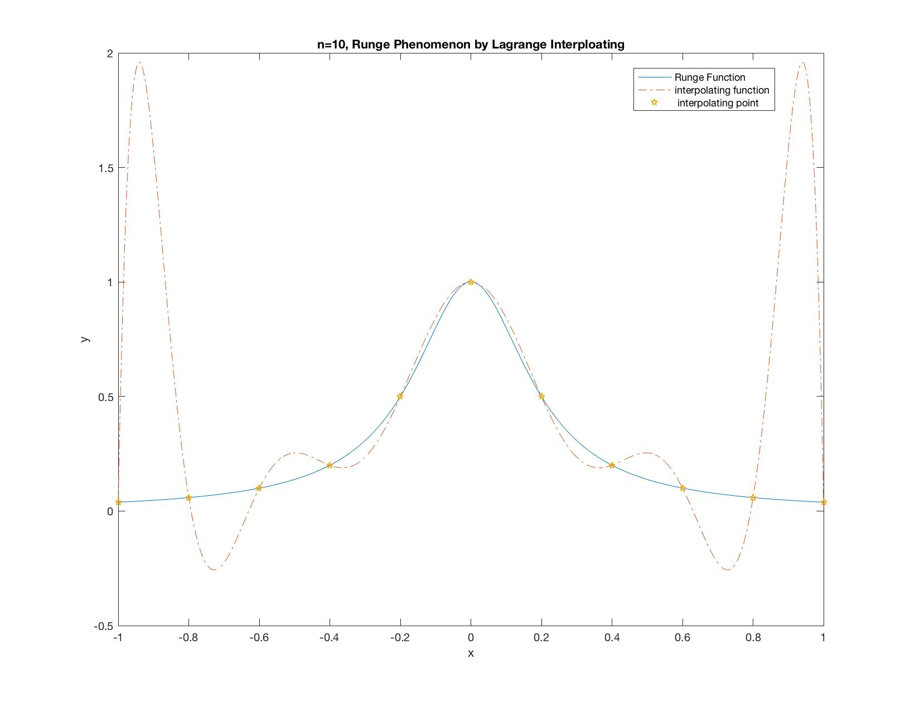
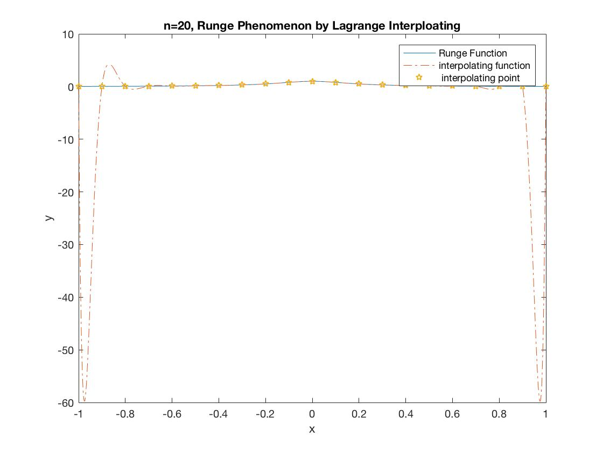
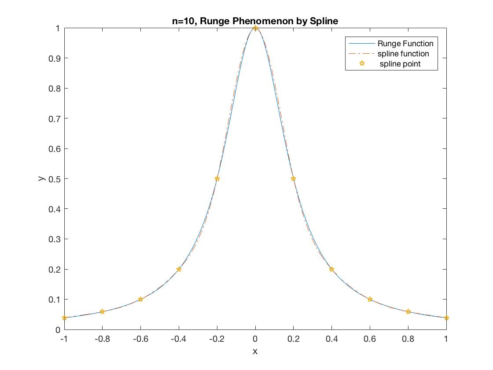
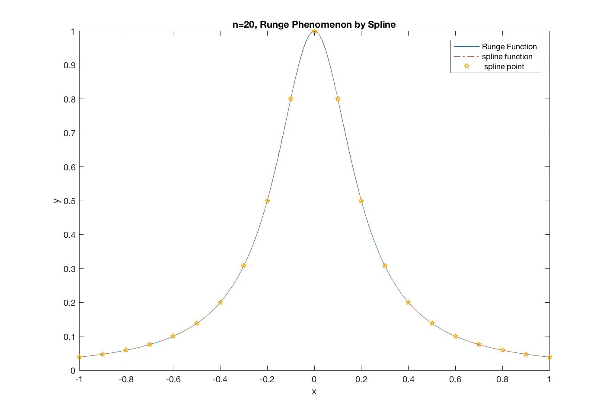
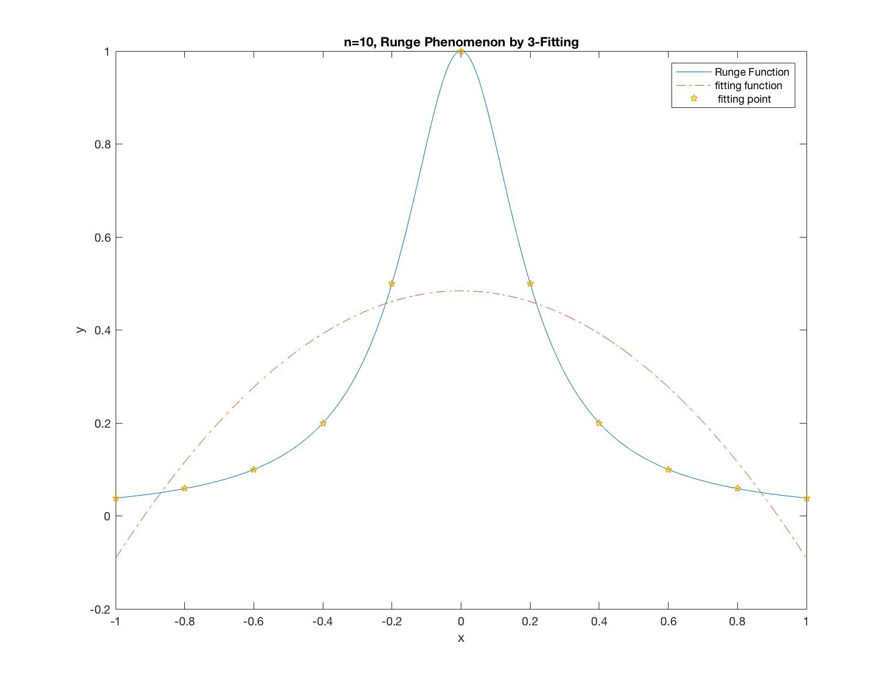
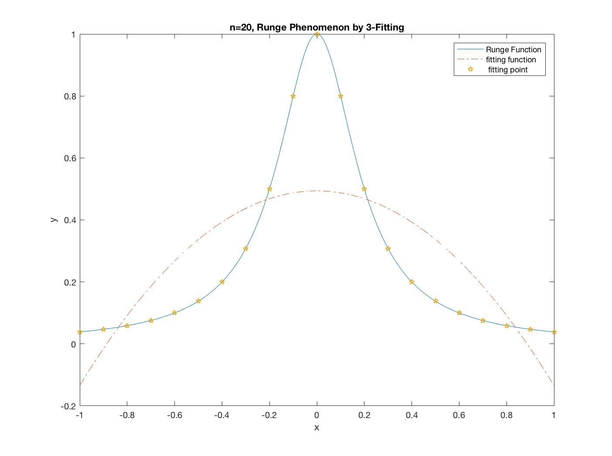
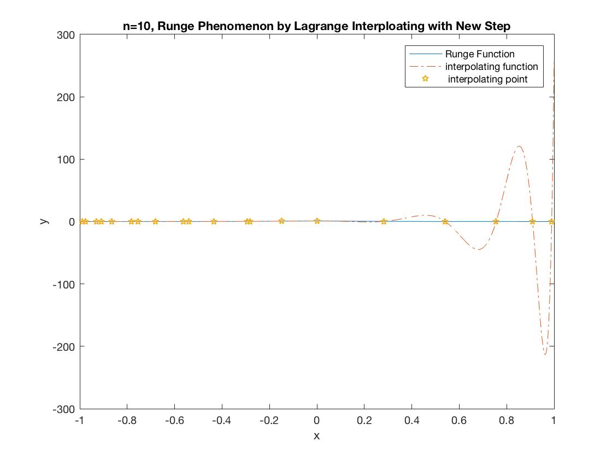
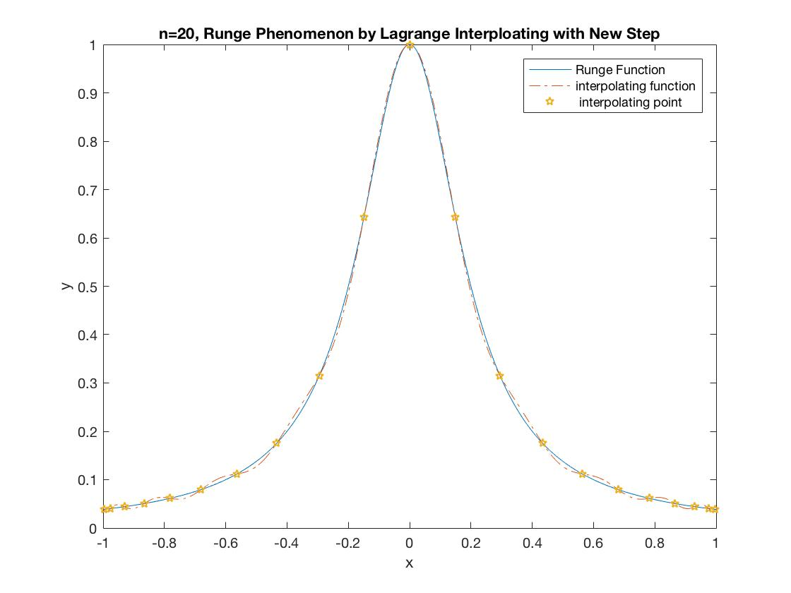
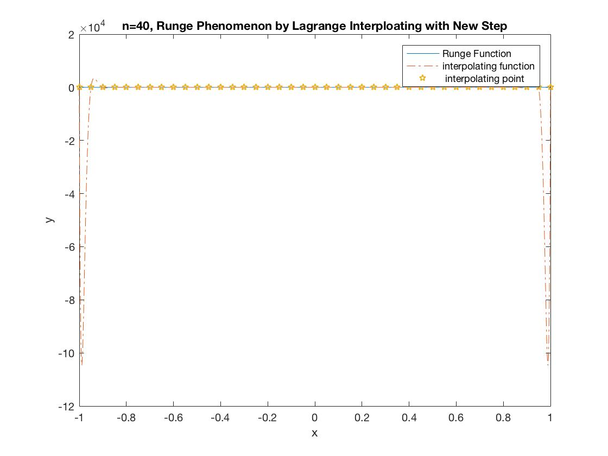

#数值分析实验报告

`秦格华`

`上海交通大学计算机科学与技术系14级本科生` 

`5140219335 `

`2016.12`
##题目一
在区间$[-1,1]$上分别取$n = 10,20$，用两组等距节点对龙格函数$f(x) = {1 \over {1+25x^2}}$作多项式插值，对每个n值，分别画出差值函数及$f(x)$的图形。

利用MATLAB定义拉格朗日插值函数如下：

```matlab
function y1=lagrange(x0,y0,x1)
n=length(x0); 
syms x; 
for k=1:n 
    l(k)=x/x; 
    for p=1:n 
        if p~=k  
            l(k)=l(k)*(x-x0(p))/(x0(k)-x0(p));
        end
    end
end
z=0; 
for k=1:n      
    z=z+l(k)*y0(k); 
end
y1=subs(z,x,x1);
```
之后我们可以利用Script来进行调用此函数并进行绘图：

```matlab
n=10;  
x0=-1:2/n:1;  
y0=1./(1+25*x0.^2); 
x=-1:.001:1;  
y1=lagrange(x0,y0,x); 
y=1./(1+25*x.^2);  
plot(x,y,x,y1,'-.',x0,y0,'p');  
legend('Runge Function','interpolating function',' interpolating point'); 
title('n=10, Runge Phenomenon by Lagrange Interploating'); 
xlabel('x'); 
ylabel('y');
```
得到$n=10$时的插值函数及$f(x)$的图像为：


在此基础上我们只需要改变Script中的$n$的大小即可得到$n=20$时的图像：


##题目二
在区间$[-1,1]$上分别取$n = 10,20$，用两组等距节点对龙格函数$f(x) = {1 \over {1+25x^2}}$作多三次样条插值，对每个n值，分别画出差值函数及$f(x)$的图形。

利用MATLAB定义三次样条插值函数如下：

```matlab
function Spline(x,y,n,s,t)   
for j=1:1:n-1                   
    h(j)=x(j+1)-x(j);  
end
for j=2:1:n-1                          
    r(j)=h(j)/(h(j)+h(j-1));  
end
for j=1:1:n-1                         
    u(j)=1-r(j);  
end
for j=1:1:n-1                          
    f(j)=(y(j+1)-y(j))/h(j);  
end
for j=2:1:n-1                       
    d(j)=6*(f(j)-f(j-1))/(h(j-1)+h(j));  
end
d(1)=0                    
d(n)=0               
a=zeros(n,n);  
for j=1:1:n                      
    a(j,j)=2;  
end

r(1)=0;                    
u(n)=0;  
for j=1:1:n-1                    
    a(j+1,j)=u(j+1);                   
    a(j,j+1)=r(j);  
end
b=inv(a) 
m=b*d'  
p=zeros(n-1,4);  %p矩阵为S(x)函数的系数矩阵 
for j=1:1:n-1     
    p(j,1)=m(j)/(6*h(j));                
    p(j,2)=m(j+1)/(6*h(j));                
    p(j,3)=(y(j)-m(j)*(h(j)^2/6))/h(j);                
    p(j,4)=(y(j+1)-m(j+1)*(h(j)^2/6))/h(j);  
end
p
```
与之前的拉格朗日插值函数的输入参数不同的是，三次样条插值需要同时将与那函数的边界点二阶导数输入，所以实现的函数的输入的参数$s,t$就代表了两个端点的二阶导数值。

同样利用Script调用函数后我们可以得到$n=10$，和$n=20$时的三次样条插值函数的函数图像：


可以明显看出，在$n=20$时插值函数在区间$[-1,1]$上已与原函数十分逼近，基本无法分辨。但在$n=10$时插值函数与与函数的区别还是有一定可见的细微的差别。

##题目三
对龙格函数$f(x) = {1 \over {1+25x^2}}$在区间$[-1,1]$上取$x_k = -1 + {2 \over {n}}k, k=0,1,2,..., n$，$n$分别取10，20，试求三次拟合曲线，打印出此曲线拟合函数，分别画出此拟合函数及$f(x)$的图形

实际上$n$次拟合的计算方法类似，实际上只是计算参数的矩阵大小不同。所以我在这里实现的n次拟合函数可以指定拟合的次数，所以传入的参数多了一个n用来指定拟合的次数。

```matlab
function y4 = Fit(x,y,n,x1) %x,y为输入，n为拟合次数
m = length(x);
syms xx
X1 = zeros(1,2*n);
for i = 1:2*n
    X1(i) = sum(x.^i);
end
X2 = [m,X1(1:n)];
X3 = zeros(n,n+1);
for j = 1:n
    X3(j,:) = X1(j:j+n);
end
X = [X2;X3];
Y=zeros(1,n);
for k = 1:n
    Y(k) = sum(x.^k.*y);
end
Y = [sum(y),Y];
Y = Y';
y3 = X\Y
z=0; 
for k=1:n      
    z=z+y3(k)*xx.^(k-1);
end
y4 = subs(z,xx,x1);
```

另外由于Script代码与之前的都类似，所以这里不再重复展示。

下面是$n = 10, n=20$时3次拟合的函数图像：

$n=10$时打印出的参数值为（从0次到最高次）：

对应的图像：


$n=20$时打印出的参数值为（从0次到最高次）：


对应的图像：


可以看出无论是$n=10$还是$n=20$时三次拟合曲线都与原函数偏差十分大，并且由于原来的取点实质上还是等距的，所以导致正负两个半轴的取值点个数相同，最终导致计算得出的三次项的系数为0，并没有比两次拟合有更好的精度。

##题目四
取点$x_k = cos{2k+1 \over {2(n+1)}} \pi, k =0,1,2,...,n$，$n$分别取10，20，对龙格函数$f(x) = {1 \over {1+25x^2}}$作多项式插值，分别画出此拟合函数及$f(x)$的图形

因为这里拉格朗日插值多项式的函数与之前并无不同，只是将Script中的数组定义有所改变，故在此不再展示插值函数的代码，只展示一下Script的代码：

```matlab
n=10;
for i=1:n+1
    x0(i) = cos(pi*(2*i - 1)/(2*n+2));
end
%x0=-1:2/n:1;  
y0=1./(1+25*x0.^2); 
x=-1:.001:1;  
y1=lagrange(x0,y0,x); 
y=1./(1+25*x.^2);  
plot(x,y,x,y1,'-.',x0,y0,'p');  
legend('Runge Function','interpolating function',' interpolating point'); 
title('n=10, Runge Phenomenon by Lagrange Interploating with New Step'); 
xlabel('x'); 
ylabel('y');
```

分别画出$n=10,n=20$时，在新的$x$间距下定义的插值函数图像为：




可以发现，在$n=10$时插值函数与原函数的偏差很大，在$x$接近1时，甚至出现了很严重的龙格现象，导致整幅图的精度下降。但是在$n=20$时，虽然在$x$接近-1时出现了一定可见的误差，但是总体来说拟合效果要远好于$n=10$，并且也好于等间距插值时得到的插值结果。

##题目五
经过比较可以很容易地发现，在等间距取点时，三次样条插值法得到的逼近效果最好（虽然它的实现最麻烦/(ㄒoㄒ)/~~），而实际上三次拟合的效果并不尽如人意。

因为三次样条插值在$n=20$时已经得到了比较好的结果，所以可能增加$n$并不会有十分明显的提升。所以这里选取了拉格朗日插值法来研究$n$增加时近似效果的变化。

$n=10$时：


$n=20$时：


$n=40$时：


经过对比，发现在拉格朗日插值法中增加$n$并不能保证增加近似的效果：虽然可以看到$n$增加后原函数与插值函数的贴合范围要更广些，但是我们也可以通过观察纵坐标单位刻度可以发现，$n$越大的情况下龙格现象出现时震荡的幅度也会增加（很容易想到，因为毕竟增加$n$后等于函数的阶数提高，一旦$x$出现小抖动，原函数的抖动可能会成倍增加）。

当然，在三次样条插值的两幅图对比中我们可以发现，$n$的增加对提高插值函数近似度的确是有帮助的。

